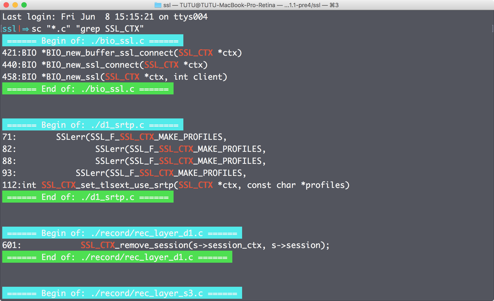
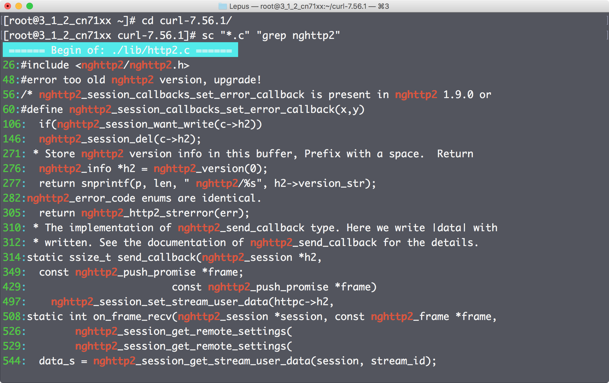

sc
================
grep and color source files.

Usage
----------------
Copy function sc() in `sc.sh` to `.\*rc` file.
```
~ sc "*.c" "grep SSL_CTX"
~ sc "*.h" "grep pcap | grep errbuf"
```

Sample output
----------------
Mac OSX(zsh):</br>


CentOS(bash):</br>
